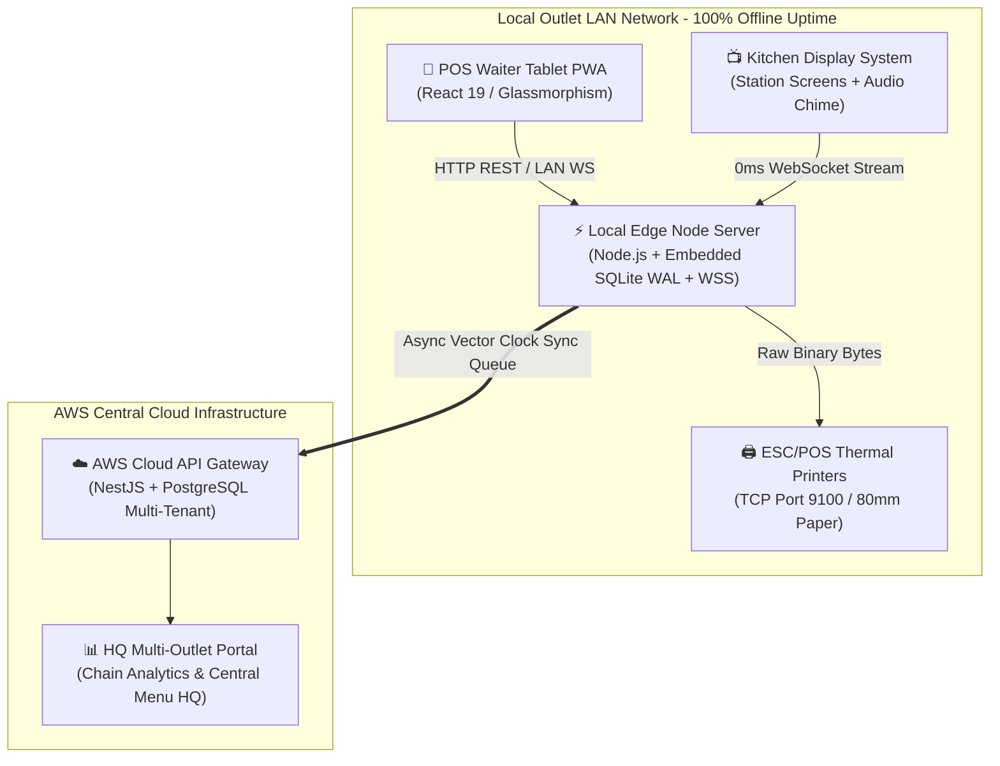

<div align="center">

# 🍽️ Restaurant Chain Management System (RCMS)

### *Enterprise Offline-First Hospitality Engine with Real-Time KDS, Native Thermal Printing & BOM Food-Cost Control*

[](https://pnpm.io/)
[](https://turbo.build/)
[](https://www.typescriptlang.org/)
[](https://react.dev/)
[](https://www.sqlite.org/)
[](https://developer.mozilla.org/en-US/docs/Web/API/WebSocket)
[](LICENSE)

<br />

**RCMS** is a high-availability, offline-first monorepo platform designed for multi-outlet restaurant chains. It couples a **Local Store Edge Server** (running SQLite WAL & WebSockets) with an **Async Cloud Synchronization Engine** to ensure 100% billing uptime, 0ms kitchen ticket delivery, and tight raw ingredient inventory control—even during complete internet outages.

</div>

---

## 🌟 Key Platform Features

| Module | Features & Capabilities |
| :--- | :--- |
| 📱 **POS Waiter Tablet PWA** | Fast glassmorphism interface, 48px touch targets, server-side PIN authentication, 12-table floor grid selection modal, live cart tax calculation, and thermal receipt generation. |
| 📺 **Kitchen Display System (KDS)** | Zero-latency WebSocket ticket delivery, station isolation filters (`GRILL`, `FRY`, `COLD`, `BAR`), 880Hz audio chime alert, and 1-tap item status bump (`PENDING` $\rightarrow$ `COOKING` $\rightarrow$ `BUMPED`). |
| 🥩 **BOM Food Cost & Stock Engine** | Recipe-level ingredient depletion applying true Yield % and Wastage % formulas to prevent food leakage and inventory theft. |
| 🖨️ **Native ESC/POS Print Driver** | Generates raw 80mm thermal receipt binary byte buffers (`0x1B 0x40` init, `0x1D 0x21` scaling, `0x1D 0x56` paper cut) streaming over TCP Port 9100 directly to Epson & Star printers. |
| 🛡️ **Append-Only Fraud Audit Log** | Every operational action (`ORDER_PLACED`, `ITEM_VOIDED`, `PRICE_OVERRIDE`, `TABLE_TRANSFERRED`) is logged to an immutable SQLite `order_events` audit table. |
| 🔄 **Vector-Clock Sync Queue** | Local SQLite transactions are tagged with vector clock sequences (`sync_queue`) to stream conflict-free events to Cloud PostgreSQL when WAN connectivity returns. |
| 📊 **Pure SQL HQ Analytics** | Zero hardcoded/fake numbers. Metrics compute pure database aggregations (`SUM(grand_total)`, `COUNT(*)`) directly from SQLite rows. |

---

## 🏛️ System Topology & Data Flow



---

## 🚀 Quick Start & Live Trial

### 1. Prerequisites
- **Node.js**: `>= 20.0.0`
- **pnpm**: `>= 9.0.0`

### 2. Installation & Setup
```bash
# Clone the repository
git clone https://github.com/Alokkr00/Restaurant-Chain-management-System.git
cd Restaurant-Chain-management-System

# Install all workspace dependencies
pnpm install

# Compile all monorepo apps and packages via Turborepo
pnpm build
```

### 3. Launch the Complete System
```bash
# Start the Edge Node Server (Port 3001)
node apps/edge-node/dist/main.js
```

Once launched, access the endpoints in your web browser:

| Application | URL | Purpose |
| :--- | :--- | :--- |
| 📱 **POS Waiter PWA** | [http://localhost:3001/pos](http://localhost:3001/pos) | Waiter tablet ordering & table map |
| 📺 **Kitchen KDS** | [http://localhost:3001/kds](http://localhost:3001/kds) | Kitchen station order screens & chime |
| 📊 **HQ Dashboard** | [http://localhost:3001/hq](http://localhost:3001/hq) | Pure SQL chain metrics & live stock |
| ⚡ **Live WebSocket Stream** | `ws://localhost:3001` | Real-time TCP event stream |

---

## 🔐 Server-Side Staff Credentials (Default PINs)

| Role | PIN | Access Permissions |
| :--- | :--- | :--- |
| **Waiter** | `1234` | Order placement, table grid selection, receipt printing |
| **Chef / Kitchen** | `5678` | KDS station filtering, item bumping, cook alerts |
| **Store Manager** | `9999` | Voids, price overrides, stock audits, daily X/Z reports |

---

## 🥩 Recipe BOM Stock Depletion Math

Raw ingredient depletion is calculated using the official `@rcms/bom-engine` formula:

$$\text{Depletion Quantity} = \left( \frac{\text{Gross Weight}}{\text{Yield Factor}} \right) \times (1 + \text{Wastage Factor}) \times \text{Servings Ordered}$$

Where:
- $\text{Yield Factor} = \frac{\text{Yield \%}}{100}$ (e.g., $85\% \rightarrow 0.85$ for dressed raw chicken)
- $\text{Wastage Factor} = \frac{\text{Wastage \%}}{100}$ (e.g., $5\% \rightarrow 0.05$ prep loss)

### Example: Ordering 2x Butter Chicken (Half)
- **Base Portion:** $0.250\text{ kg}$ chicken
- **Calculation:** $\left(\frac{0.250}{0.85}\right) \times 1.05 \times 2 = \mathbf{0.6176\text{ kg}}$ raw chicken automatically deducted from SQLite stock balances.

---

## 📁 Monorepo Structure

```text
Restaurant-Chain-management-System/
├── apps/
│   ├── edge-node/       # Local outlet master server, SQLite WAL DB & WebSocket server
│   ├── pos-waiter/      # Unified React 19 Glassmorphism SPA (POS, KDS, HQ UI)
│   ├── kds/             # KDS station screen app target
│   ├── hq-portal/       # Executive HQ multi-outlet portal target
│   └── cloud-api/       # Cloud API gateway for central PostgreSQL sync
├── packages/
│   ├── bom-engine/      # Multi-level recipe ingredient depletion engine
│   ├── gst-engine/      # Indian 5% GST tax calculation engine
│   ├── shared-types/    # Domain types, Enums & DTO contracts
│   └── sync-protocol/   # Vector clock event envelope & sync queue schemas
└── services/
    └── print-agent/     # Native ESC/POS thermal printer TCP socket driver
```

---

## 🧪 Running Integration Tests

To run the automated production audit verification script:

```bash
node scratch/test-production-audit.js
```

### Verification Test Suite Coverage:
- ✅ **Pure SQL HQ Metrics:** Asserts `$0.00` sales on fresh cold start (zero fake numbers).
- ✅ **BOM Engine Depletion:** Validates exact raw chicken stock deduction matching yield & wastage math.
- ✅ **SQLite KDS Persistence:** Confirms active kitchen tickets reload 100% intact from disk after server restart.

---

## 🤝 Contributing

Contributions are welcome! Please feel free to submit a Pull Request or open an Issue on GitHub.

---

## 📄 License

This project is licensed under the **MIT License** - see the [LICENSE](LICENSE) file for details.  
Developed & Maintained by **[Alok Kumar](https://github.com/Alokkr00)**.
